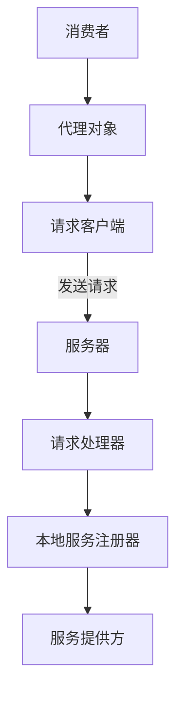
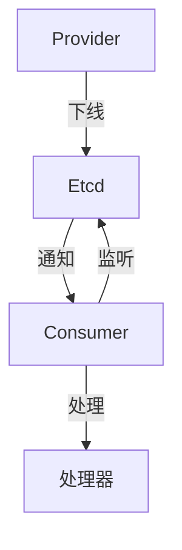
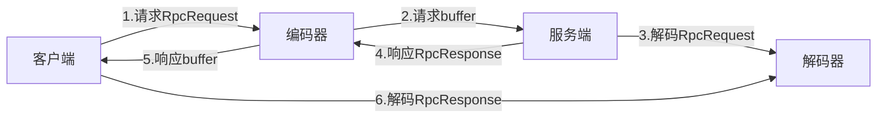

# 一个简单的RPC项目

>参考[鱼皮的RPC](https://github.com/liyupi/yu-rpc/tree/master)

## RPC

RPC是一种用于实现分布式系统中不同服务间通信的技术。它使得服务之间可以像调用本地函数一样进行远程调用，
隐藏了底层网络通信的细节，提供了简单的接口让服务之间进行通信和交互。

在微服务架构中，网关可以与RPC框架结合使用，以提供更灵活和强大的服务调用和路由功能。
例如，网关可以将外部请求路由到合适的微服务，并使用RPC进行远程调用。

具体来说，网关可以将外部请求转发到适当的微服务实例，并使用RPC框架与目标微服务进行通信。
这样，网关可以扮演一个代理角色，将外部请求翻译为RPC调用，然后将返回结果返回给请求方。
网关还可以处理请求的路由、负载均衡、安全认证等功能，以增强系统的稳定性和安全性。

### 基本架构




### example-common

服务相关的接口和数据模型，例如：User和UserService

### rpc-core

#### Config

**Hutool**：提供了读取和操作配置文件（e.g. application.properties）的功能

```java
// 创建Properties对象
Props props = new Props("${applicaiton.properties}");

// 获取配置项的值
String value = props.getProp("key");

// 将properties映射到配置类
props.toBean(Class<T>);

```


#### Register Center

提供方将服务信息注册在注册中心，消费方从注册中心获取到提供方的信息，然后向提供方发起调用。

需要实现的能力：

- 注册信息数据的存储
- 服务注册
- 服务发现
- Healthy Check
- 服务注销


**基于Etcd的实现**



#### Custom Protocol

**为什么需要自定义协议而不是http？**

Http协议只是RPC进行网络传输时的一种可选协议，其本身头部信息和响应格式较重，影响网络传输性能。

Http属于应用层协议，性能慢于TCP这类传输层协议，因此可以基于TCP构建新协议。

**Need to do**：

- 自定义网络传输
- 自定义消息结构


**基于TCP的自定义协议：**




### Q&A

1. 为什么要用代理（Proxy）对象？

   Proxy充当了客户端和服务端的中间层，可以进行拦截请求，权限验证等操作。通常代理对象的作用有：

      - 隐藏底层细节
      - 安全控制
      - 附加功能
      - 资源管理

## 问题记录

1. GitLab浏览器能够访问，但Idea中连接超时，电脑已开启代理

    在CMD中配置VPN使用的端口

    ```shell
   git config --global http.proxy 127.0.0.1:${port}
   ```
